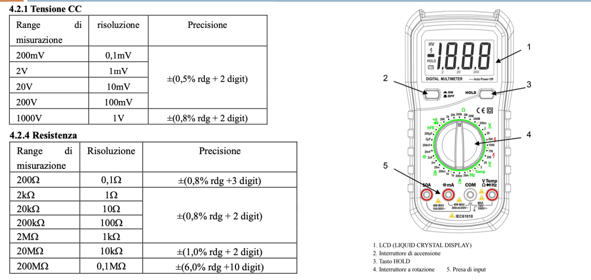
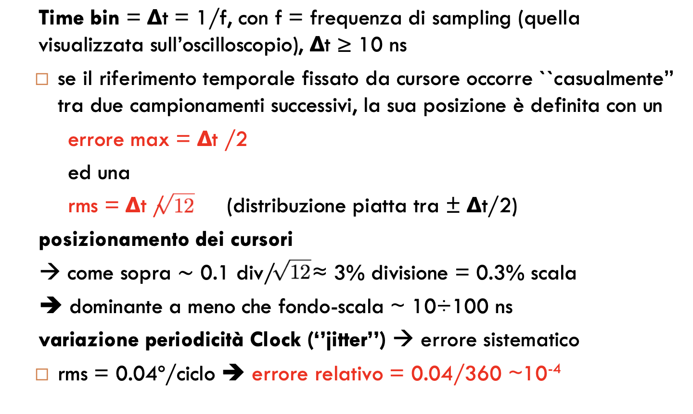
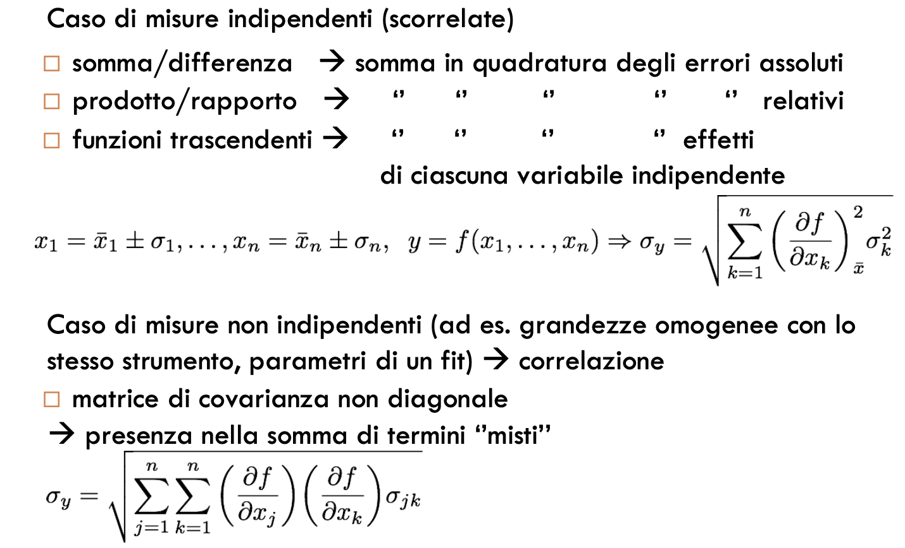
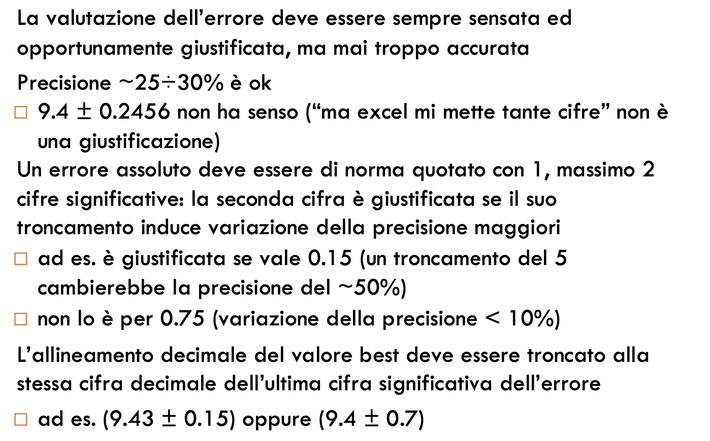
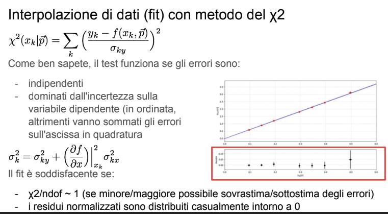

## misure rumorose con AD2
per misure tanto rumorose si considera come errore la differenza tra ycursor sopra e sotto del canale 2 (presi sui margini del segnale rumoroso), preso solo perche' maggiore dell'errore causale divisone/10/sqrt(12)

## misure in tensione con AD2
waveforms measurements ampiezza: errore \pm 10mV +\p 0.5%
- risoluzione ADC:
	incertezza casuale, calcolata come $0.3\ mV$ per fondo scala minore o uguale di $0.5\ V/div$ o $3\ mV$ per fondo scala maggiore o uguale di $1\ V/div$.
- utilizzo dei cursori: 
	Regolare i cursori equivale ad utilizzare una scala graduata: posso assumere che la lettura si collochi all'interno di quella divisione in maniera equiprobabile (incertezza casuale).
	Per un fondo scala di $\text{n V/div}$, essendoci 10 "tacchette" in una divisione devo dividere $n$ per $10$ e dividere il valore trovato per $\sqrt{12}$, ovvero la radice della varianza della distribuzione piatta.

	Sarebbero circa $0.1\ div / \sqrt{12} \approx 3\% \ \text{divisione} = 0.3\%\ \text{scala}$	  
- la presenza di rumore nel circuito introduce incertezza casuale risultante dallo spessore della traccia oscillografica (eliminabile prendendo la media)
- calibrazione relativa DAC ADC: incertezza sistematica relativa
	$rms = 0.2\ \%\ ,\ max = 0.5\ \%$
- calibrazione assoluta:
	incertezza sistematica, $10mV$ per fondo scala $\le\ 0.5V$ o $100mV$ per fondo scale $\ge 1V$
	non si applica alle misure effettuate sui circuiti i cui segnali di ingresso sono pilotati da Wavegen

gli errori relativi sulle singole misure di ampiezza dei singoli canali vanno sommati in quadratura nel calcolo dell'errore sistematico globale sul loro rapporto - che sarebbe la misura di guadagno

### misure coi cursori
È SEMPRE buona norma regolare i fondo-scala per un'ottimale visualizzazione
dei segnali (nell'immagine su Ch2 la
scelta è adeguata, su Ch1 proprio NO!)
A questa regolazione si correlano le incertezze
assolute sulle misure effettuate con i cursori
(0.3% intero range per posizionamento singolo
cursore, 0.4% sulla differenza)
Con 5V di range (come in figura) l'errore dovrebbe essere 20mV
⇒ precisione compresa tra 5 e 10%
(grossolana, potenzialità dello strumento non sfruttata)

## Misure di tensione/resistenza col multimetro

per le resistenze 0.8% + n digit

Per una resistenza da 10k e' 80ohm

Da data-sheet, l'incertezza è quotata come 0.8% lettura + 2 digits
⇒ l'informazione è che esistono due sorgenti di incertezza (comuni a molti
strumenti digitali) legate ad errori di:
- calibrazione di scala (probabilmente associata alla misura analogica di
corrente);
- conversione analogico-digitale (ovvero risoluzione di un ADC).
Si tratta di errori indipendenti? SI! Allora vanno
sommati in quadratura (la somma lineare fornisce
una sovrastima delle incertezze)
## Misure di capacità col multimetro
4% + 2 digit

## Misure di tempo/frequenza con AD2

## Propagazione degli errori

## Convenzione sulle cifre significative

# chi quadro
chi quadro / gradi di libertà

- i gradi di libertà sono il numero di misure - i parametri del fit

Come ben sapete, il test funziona se gli errori sono:
- indipendenti
- dominati dall'incertezza sulla
variabile dipendente (in ordinata,
altrimenti vanno sommati gli errori
sull'ascissa in quadratura
	
Il fit è soddisfacente se:
- χ2/ndof ~ 1 (se minore/maggiore possibile sovrastima/sottostima degli errori)
- i residui normalizzati sono distribuiti casualmente intorno a 0

# FIT
Indicazioni per i fit con Python
- Se una delle due variabili ha incertezze molto minori rispetto a quell'altra, è
bene che sia utilizzata come ascissa
- Evitate di "gonfiare" le incertezze per fare in modo che l'accordo con i dati sia
migliore
- Non vanno inclusi i sistematici, come ad es. quelli legati alla calibrazione di
una scala di tensione, che non sono indipendenti (sposterebbero
coerentemente tutte le misure nella stessa direzione); in questo caso gli errori
sistematici devono essere combinati solo alla fine con i parametri di best-fit;
ad esempio, nella misura di un guadagno ottenuto da un fit di Vout vs. Vin,
occorre aggiungere un'incertezza sistematica relativa dello 0.7% all'errore
sulla pendenza sul coefficiente angolare della retta di best-fit
- Non usate MAI l'opzione "absolute_sigma = False" che modifica gli errori
scalandoli a posteriori (si tratta di una maniera surrettizia di mettere la polvere
sotto il tappeto...), perché poi il χ2 non è più coerente con il plot dei residui...

In particolare bisogna fare i fit con absolute_sigma=True, senza includere gli errori sistematici, che vanno poi inclusi nel valor medio dopo il fit.